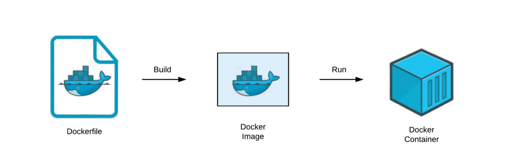

Hey welcome back to my blog, this time we going to learn about containers, Docker and we going to reuse the Github Actions knowledge. 

## What is a container?

A container is a standard unit of software that packages up code and all its dependencies so the application runs quickly and reliably from one computing environment to another. A Docker container image is a lightweight, standalone, executable package of software that includes everything needed to run an application: code, runtime, system tools, system libraries and settings.

Container images become containers at runtime and in the case of Docker containers – images become containers when they run on Docker Engine. Available for both Linux and Windows-based applications, containerized software will always run the same, regardless of the infrastructure. Containers isolate software from its environment and ensure that it works uniformly despite differences for instance between development and staging.


## Diferences between Containers and VMs

Containers and virtual machines have similar resource isolation and allocation benefits, but function differently because containers virtualize the operating system instead of hardware. Containers are more portable and efficient.


## The famous Dockerfile

Docker can build images automatically by reading the instructions from a Dockerfile. A Dockerfile is a text document that contains all the commands a user could call on the command line to assemble an image. Using docker build users can create an automated build that executes several command-line instructions in succession. This file is formated in YAML.

The advantage of a Dockerfile over just storing the binary image (or a snapshot/template in other virtualization systems) is that the automatic builds will ensure you have the latest version available. This is a good thing from a security perspective, as you want to ensure you’re not installing any vulnerable software.


## Docker Hub

Docker Hub is a service provided by Docker for finding and sharing container images with your team. It is the world’s largest repository of container images with an array of content sources including container community developers, open source projects and independent software vendors (ISV) building and distributing their code in containers.

Users get access to free public repositories for storing and sharing images or can choose a subscription plan for private repositories.

The best part of Dockerhub is that you can deploy your Docker images from Docker Hub very easy only calling the Image from the repo at the moment of deploy a container.



## The process

In this challenge i need to deploy a Frontend running in Nginx using a Dockerfile and create a pipeline for post the Docker image to DockerHub.

>1st step:

Create the repository in Github  [GitHub Pages](https://pages.github.com/).

>2nd step:

Build the docker file

```js
FROM nginx:alpine
LABEL maintainer="xKingrd"
ADD ./images /usr/share/nginx/html/images
ADD ./css /usr/share/nginx/html/css
COPY ./index.html /usr/share/nginx/html/
EXPOSE 80
EXPOSE 443
ENTRYPOINT ["nginx", "-g", "daemon off;"]
```

The images, css and all the files are on my github repo.

>3rd step:

Create the CI Pipeline

```js
name: ci

on:
  push:
    branches:
      - 'main'


jobs:
  docker:
    runs-on: ubuntu-latest
    steps:
      -
        name: Checkout
        uses: actions/checkout@v2
      -
        name: Set up QEMU
        uses: docker/setup-qemu-action@v2
      -
        name: Set up Docker Buildx
        uses: docker/setup-buildx-action@v2
      -
        name: What
        run: echo "ATTEMPT=${GITHUB_RUN_NUMBER}" >> $GITHUB_ENV
      -
        name: Login to DockerHub
        uses: docker/login-action@v2
        with:
          username: ${{ secrets.DOCKERHUB_USERNAME }}
          password: ${{ secrets.DOCKERHUB_TOKEN }}
      -
        name: Build and push
        uses: docker/build-push-action@v3
        with:
          context: .
          push: true
          tags: xkingrd/littlelink:v${{ env.ATTEMPT }}

```

The username and password are storage in the repo secrets in Github, the ATTEMPT variable generate the version number for the image at the moment of the build and upload process.

## My Opinion

This challenge was more easy in my opinion, Github Actions keeps been useful very easy to use. In this project i found a Docker oficial Actions on Github Actions using this oficial action i feel more save about my data.

Dockerhub works very good and with the versioning of the images, helps to keep a very clean and trasable view of the image history.
